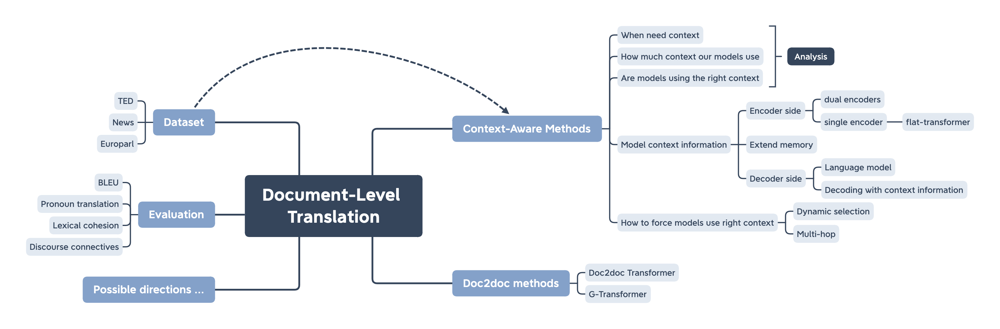
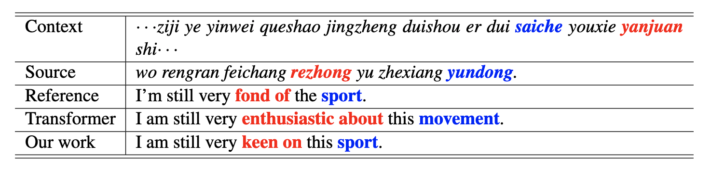

# A New Chapter for Neural Machine Translation: Moving to Document-level Period

  

This repository contains a list of papers, open-sourced codes, and datasets in Document-level NMT field which is carefully and comprehensively organized. If you found any error, please don't hesitate to open an issue or pull request.

## Introduction

## Context-Aware Methods

### Why do we need context?

Elena Voita, Rico Sennrich, Ivan Titov [When a Good Translation is Wrong in Context: Context-Aware Machine Translation Improves on Deixis, Ellipsis, and Lexical Cohesion](https://dx.doi.org/10.18653/v1/p19-1116)

Examples for disambiguation:

### What is _context_ ?

All these extra informations may be need during translation, and works in this section mainly focus on how to model these features in machine translations systems.

* Intra-sentential (within the current sentence)
* Inter-sentential (across multiple sentences)
* Extra-linguistic (e.g. social, temporal, cultural)

### How can we model context information?

* Encoder sides
  * Dual encoders
    * Jiacheng Zhang, Huanbo Luan, Maosong Sun, Feifei Zhai, Jingfang Xu [Improving the Transformer Translation Model with Document-Level Context](https://dx.doi.org/10.18653/v1/d18-1049)
  * Single Encoder
    * Shuming Ma, Dongdong Zhang, Ming Zhou [A Simple and Effective Unified Encoder for Document-Level Machine Translation](https://dx.doi.org/10.18653/v1/2020.acl-main.321)
* Decoder sides
  * Decoding with context
    * Hayahide Yamagishi, Mamoru Komachi [Improving Context-aware Neural Machine Translation with Target-side Context](https://arxiv.org/abs/1909.00531)
  * Language model
    * Amane Sugiyama, Naoki Yoshinaga [Context-aware Decoder for Neural Machine Translation using a Target-side Document-Level Language Model](https://arxiv.org/abs/2010.12827)
* Extend Memory
  * Zhaopeng Tu, Yang Liu, Shuming Shi, Tong Zhang [Learning to Remember Translation History with a Continuous Cache](https://arxiv.org/abs/1711.09367)

### How much are these models actually using?

* Kayo Yin, Patrick Fernandes, Danish Pruthi, Aditi Chaudhary, André F T Martins [Do Context-Aware Translation Models Pay the Right Attention?](https://arxiv.org/abs/2105.06977)

### Can we encourage them to do better?

* Xiaomian Kang, Yang Zhao, Jiajun Zhang, Chengqing Zong [Dynamic Context Selection for Document-level Neural Machine Translation via Reinforcement Learning](https://arxiv.org/abs/2010.04314)
* Long Zhang, Tong Zhang, Haibo Zhang, Baosong Yang, Wei Ye [Multi-Hop Transformer for Document-Level Machine Translation](https://dx.doi.org/10.18653/v1/2021.naacl-main.309)

## Document-level Solutions

* Doc2doc transformers
  * Zewei Sun, Mingxuan Wang, Hao Zhou, Chengqi Zhao, Shujian Huang, Jiajun Chen, Lei Li [Capturing Longer Context for Document-level Neural Machine Translation: A Multi-resolutional Approach](https://arxiv.org/pdf/2010.08961.pdf)
* G-transformers
  * Guangsheng Bao, Yue Zhang, Zhiyang Teng, Boxing Chen, Weihua Luo [G-Transformer for Document-level Machine Translation](https://arxiv.org/abs/2105.14761)
* Mbart
  * Yinhan Liu, Jiatao Gu, Naman Goyal, Xian Li, Sergey Edunov, Marjan Ghazvininejad, Mike Lewis, Luke Zettlemoyer [Multilingual Denoising Pre-training for Neural Machine Translation](https://arxiv.org/abs/2001.08210)

## Dataset

## Evaluation

* [Tangled up in BLEU: Reevaluating the Evaluation of Automatic Machine Translation Evaluation Metrics](https://dx.doi.org/10.18653/v1/2020.acl-main.448)